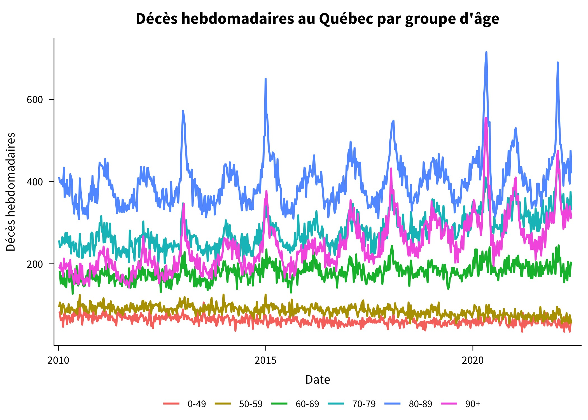
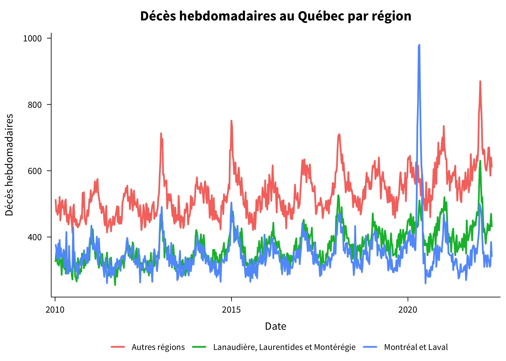
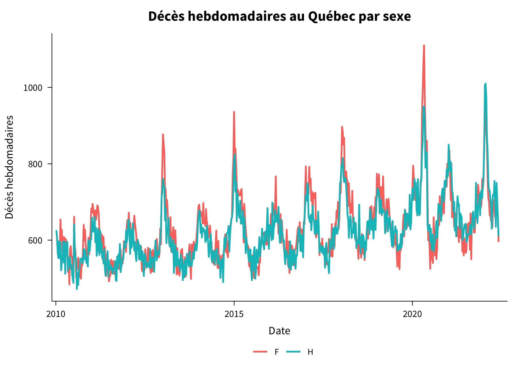
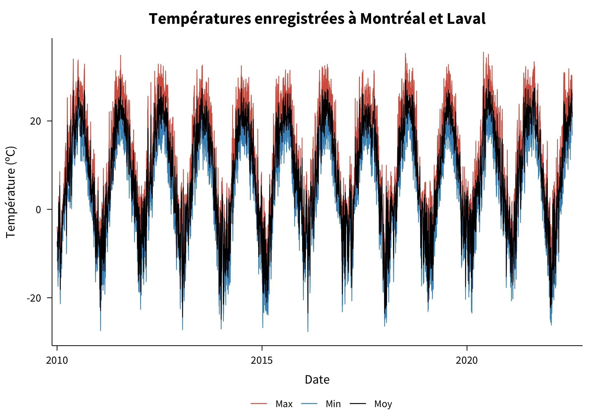
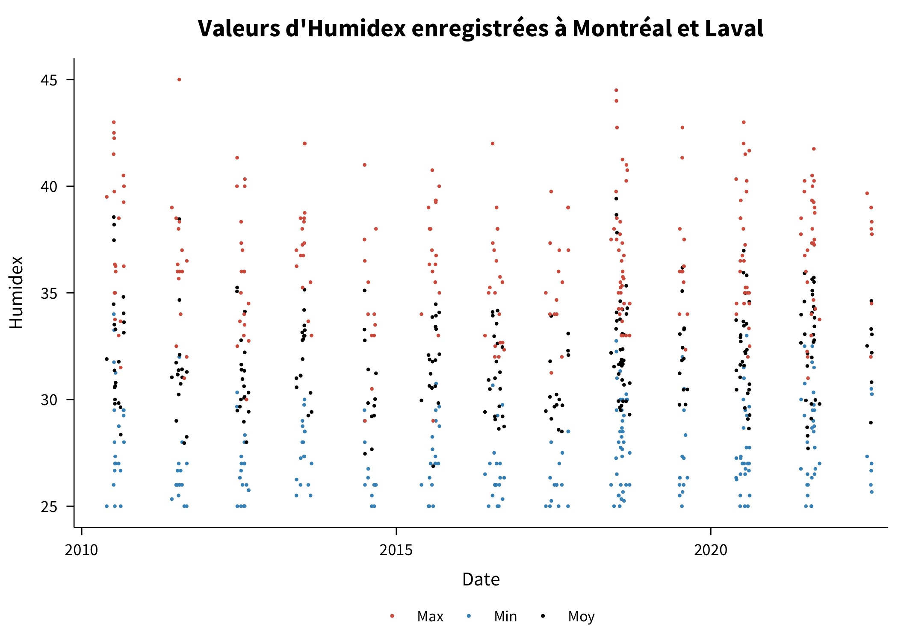
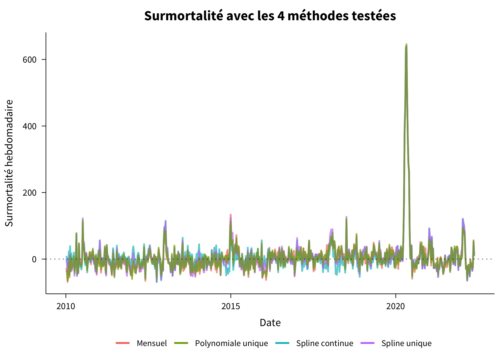
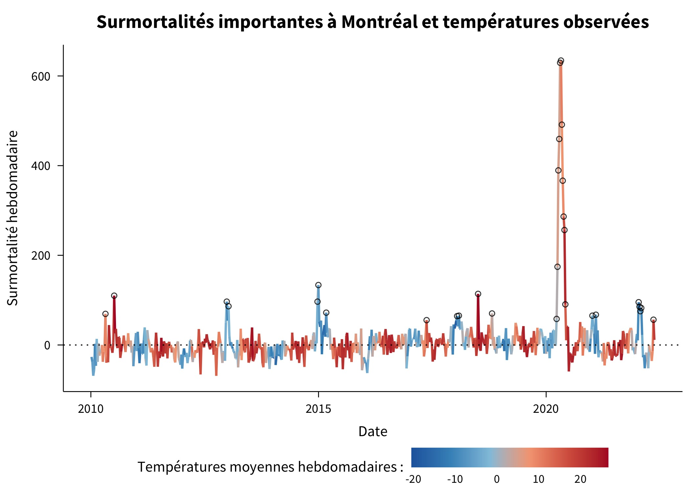
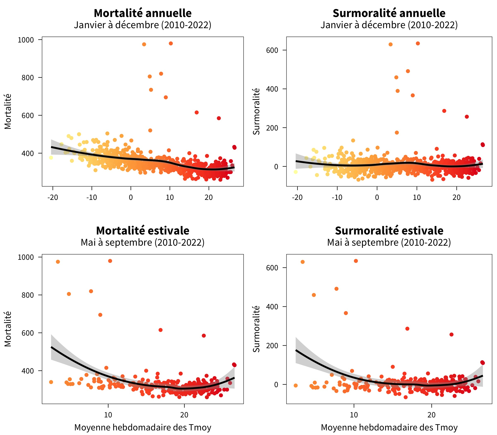
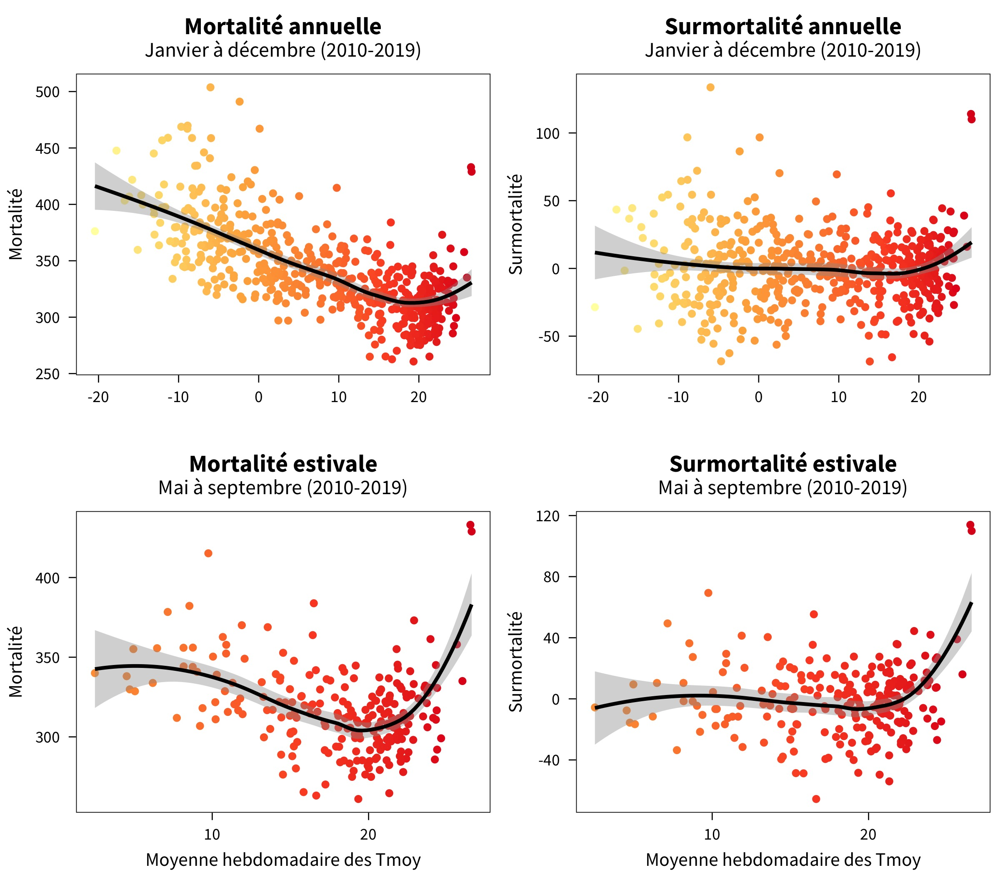
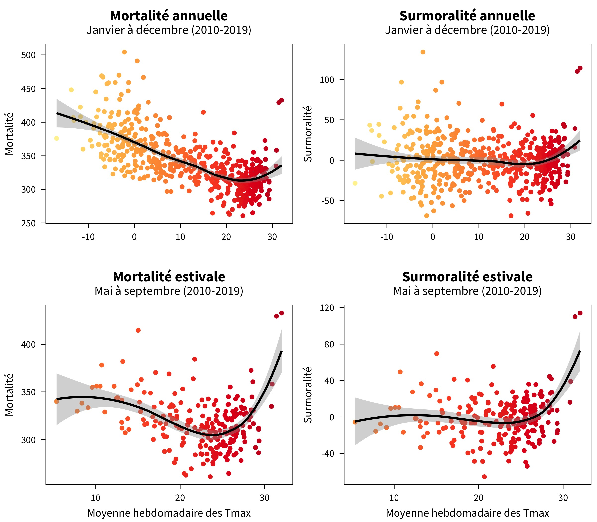

Décès hebdomadaires à Montréal et à Laval en fonction de la chaleur observée 🌇
================================================================================

+ Un projet réalisé dans le cadre de mon Ph. D. à l'[Institut national de la recherche scientifique](http://inrs.ca) (INRS)
+ Les scripts et les données sont rendus disponibles sous la license [Creative Common License ](http://creativecommons.org/licenses/by-nc-nd/4.0/)
+ Les question peuvent être addressées directement à l'adresse : [Prénom.Nom@inrs.ca](mailto:Prénom.Nom@inrs.ca)

À l'aide de données de décès hebdomadaires de l'Institut de la Statistique du Québec (ISQ), je tente de voir si des pics de décès peuvent être associés à des épisodes de chaleur extrême durant l'été à Montréal et Laval, Québec, Canada.

Ce travail est un projet exploratoire qui fait partie de mon Ph. D. en santé environnementale et en science des données à l'INRS. Il chercher à démontrer la possibilité d'utiliser des données ouvertes (décès et météo) pour analyser les relations entre la santé et l'environnement.

Données
--------------------------------------------------------------------------------

J'ai téléchargé les données de décès hebdomadaires de `2010` à `2022` à partir du site web de l'[Institut de la Statistique du Québec](https://statistique.quebec.ca/fr/document/nombre-hebdomadaire-de-deces-au-quebec) (ISQ). 

**Figure 1.1 : Décès hebdomadaires par âge**

**Figure 1.2 : Décès hebdomadaires par région**

**Figure 1.3 : Décès hebdomadaires par sexe**

J'ai ensuite téléchargé les données des stations météorologiques d'[Environnement et Changement climatique Canada](https://climate.weather.gc.ca/historical_data/search_historic_data_e.html) (ECCC) situées à Montréal et Laval à l'aide de l'API d'ECCC. Je n'ai retenu que les stations qui avaient des données au pas de temps horaire dans ces deux régions.

**Figure 2 : Cartes des stations de ECCC à Montréal et Laval**

Les jeux de données horaires ont été préférés à ceux quotidiens car ils contiennent plus de variables que les aggrégations quotidiennes (p. ex. Humidex, pression, humidité relative, etc.).  Des métriques quotidiennes de plusieurs variables météorologiques ont été calculées à partir des observations horaires : 

+ Température (minimale, moyenne et maximale)
+ Température moyenne au point de rosée
+ Humidité relative moyenne
+ Humidex (minimal, moyen et maximal)
+ Vitesse moyenne des vents 
+ Pression moyenne
+ Visibilité moyenne
+ Précipitation totale

À des fins de simplication, les données de toutes les stations ont été aggrégées spatialement.

**Figure 3.1 : Températures quotidiennes à Montréal et Laval**

**Figure 3.2 : Valeurs quotidiennes d'Humidex à Montréal et Laval**

Finalement, les données météorologiques ont été ramenées au pas de temps hebdomadaire en prenant la moyenne des valeurs observées durant la semaine. Ces données ont été fusionnées avec les données de décès totaux hebdomadaire de l'ISQ pour la région de Montréal et Laval.

> **Note** : J'ai aussi téléchargé les données de [DayMet](https://daymet.ornl.gov/), des données quotidiennes de réanalyse de la NASA à un résolution de 1km x 1km sur tout l'Amérique du Nord pour plusieurs variables d'intérêt : température minimale et maximale, précipitations, rayonnement solaire, vapeur d'eau, etc. Cependant, ces données n'ont pas été utilisé dans le présent projet car elles étaient similaires aux données d'ECCC.

Résultats
--------------------------------------------------------------------------------

Plutôt que d'étudier les mortalités directement, j'ai convenu qu'il serait mieux de regarder les surmortalités, c'est-à-dire les pics de mortalité au-delà de ceux normalement attendus. J'ai utilisé 4 méthodes pour trouver les surmortalités :

+ **Mensuel** : Moyenne des mortalités pour chaque mois de l'année
+ **Polynomiale unique** : Fonction polynomiale de degrée 3 en fonction du numéro de la semaine
+ **Spline unique** : Spline unique en fonction du numéro de la semaine
+ **Spline continue** : Spline continue en fonction du temps (période pré-COVID-19 seulement)

**Figure 4 : Surmortalité calculée avec les 4 méthodes**

Les surmortalités résultantes avec les 4 méthodes étant très similaires, nous avons retenu la méthode par mois pour les calculs qui suivent.

Les données de températures ont ensuite été ajoutées conjointement avec les mortalités et surmortalités. Un graphique intéressant était d'extraire les 30 plus grandes surmortalités en fonction de la température observée.

**Figure 5 : Surmortalités importantes à Montréal et temprératures**

Finalement, des relations ont été établis entre la température observée (moyenne ou maximale) et la mortalité/surmortalité pour Montréal et Laval.

**Figure 6.1 : Relation avec les températures moyennes (2010-2022)**

**Figure 6.2 : Relation avec les températures moyennes (2010-2019)**

**Figure 6.3 : Relation avec les températures maximales (2010-2019)**

Conclusion
--------------------------------------------------------------------------------

La mortalité/surmortalité à Montréal et Laval augmente de manière non linéaire à mesure les températures deviennent plus élevées. De plus, les pics de surmortalité permettent d'identifier les pics d'importance en lien avec des épisodes particulièrement chauds, notamment en 2010, en 2018, en 2020 (simultanément à un de COVID-19) et en mai 2022, plus récemment.

Pistes futures
--------------------------------------------------------------------------------

+ Bâtir un modèle prédictif pour la relation décès-chaleur avec d'autres variables météos
+ Raffiner la méthode utilisée pour extraire la surmortalité
+ Mieux gérer les données manquantes dans les données horaires en utilisant les flags de ECCC
+ Déplacer les fonctions R au sein d'un package (`jutils`)

**Enjoy !** ✌🏻
