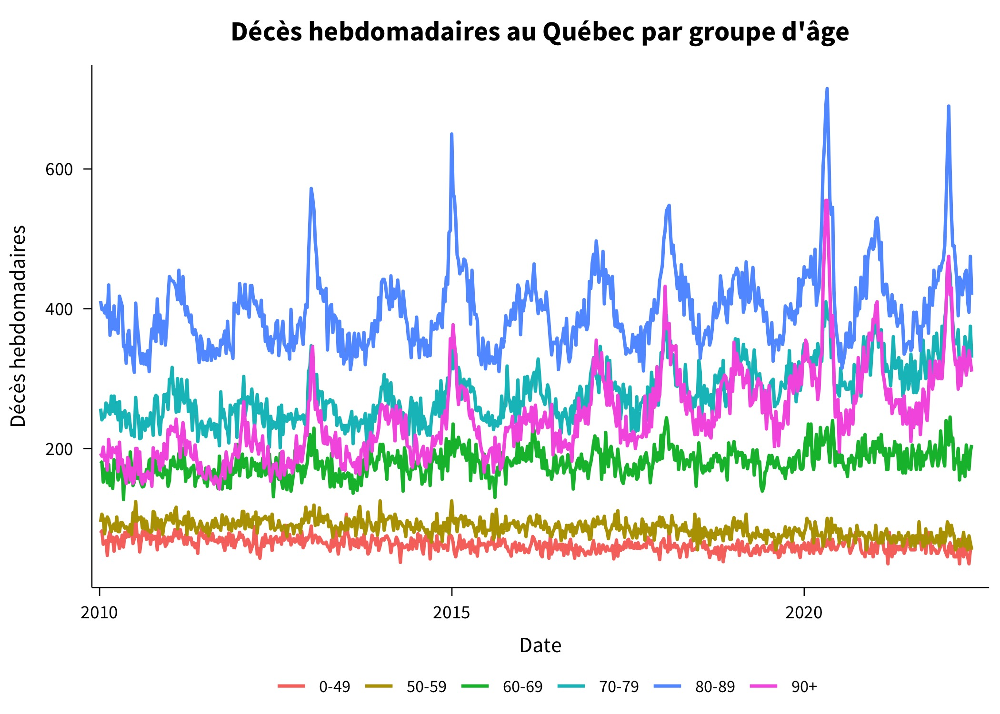
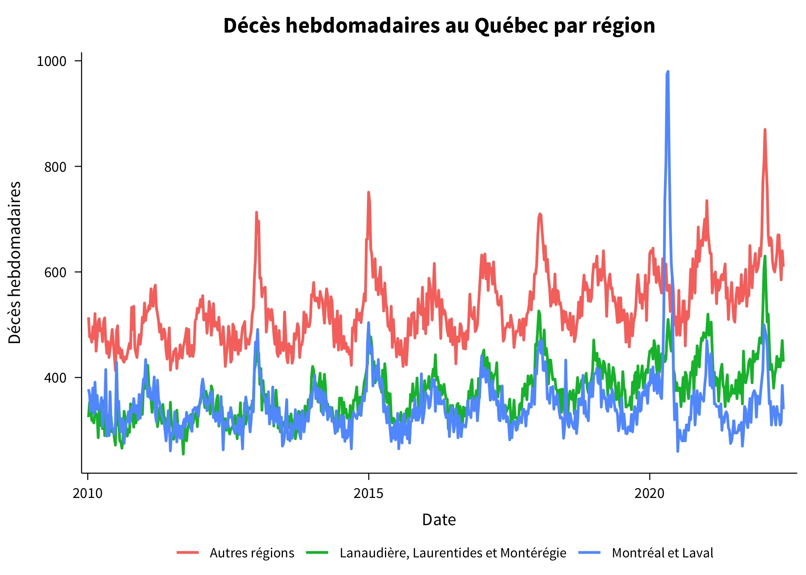
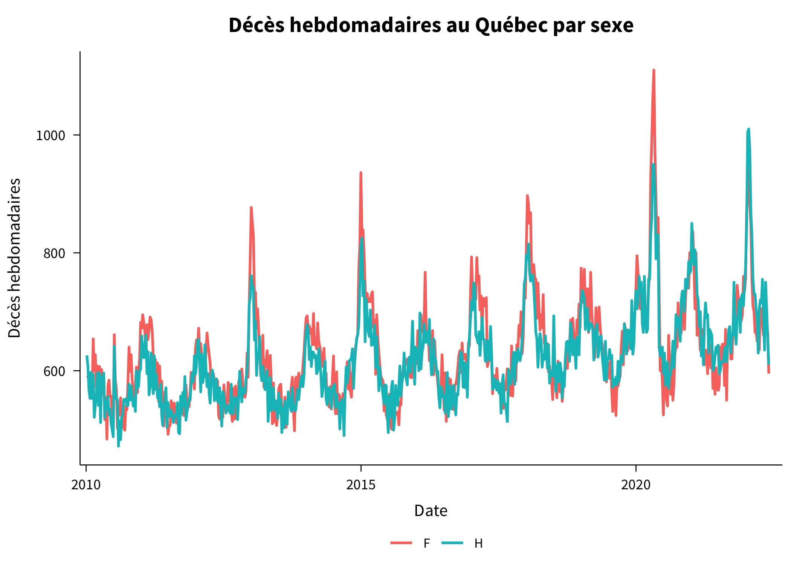
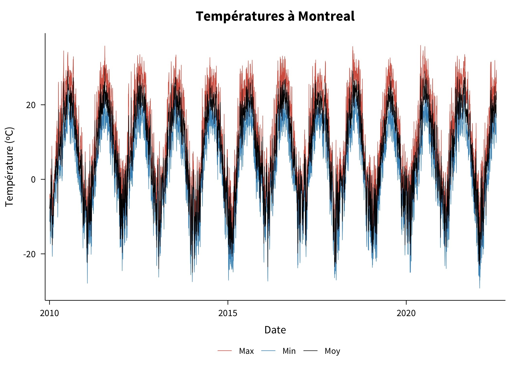
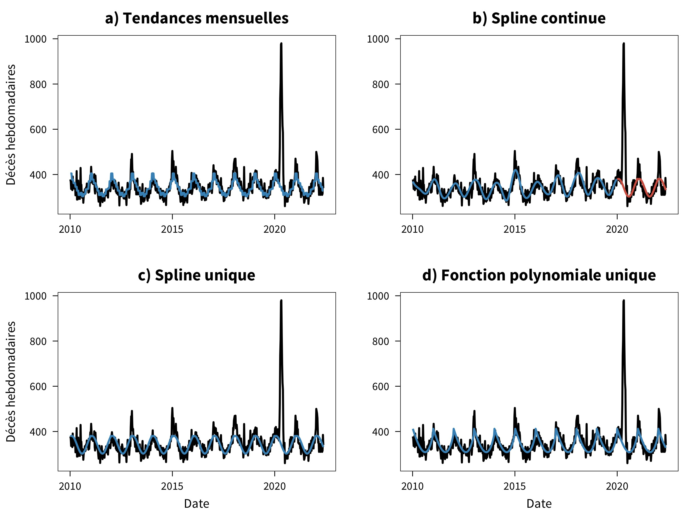
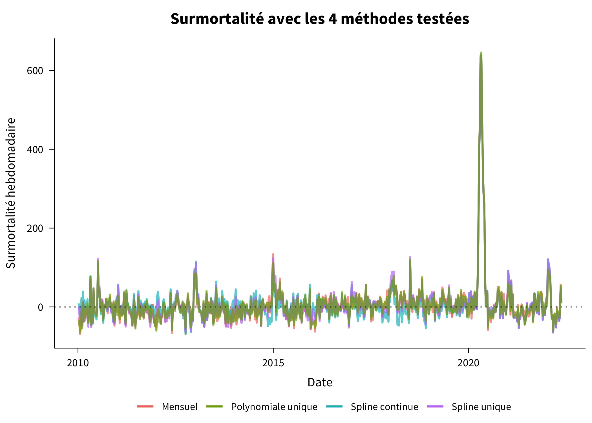
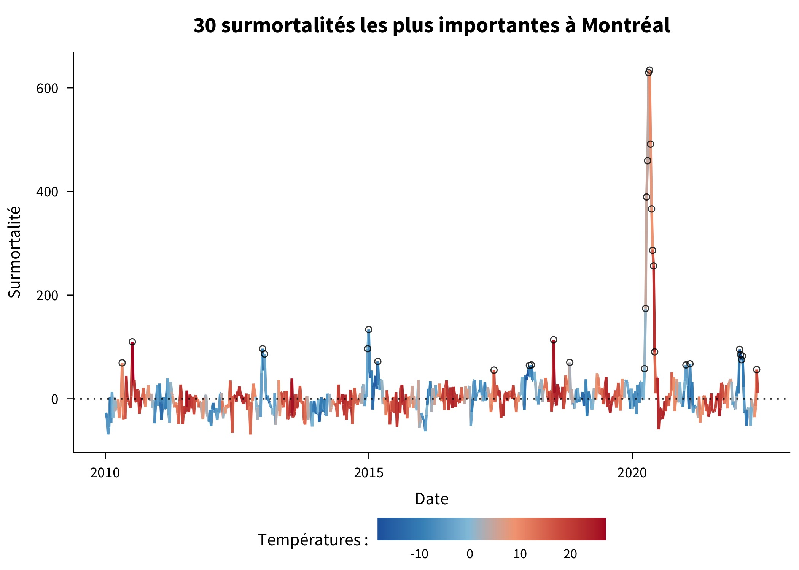
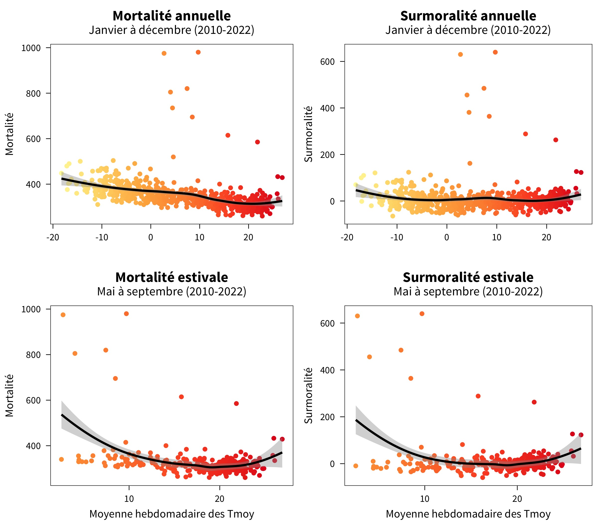
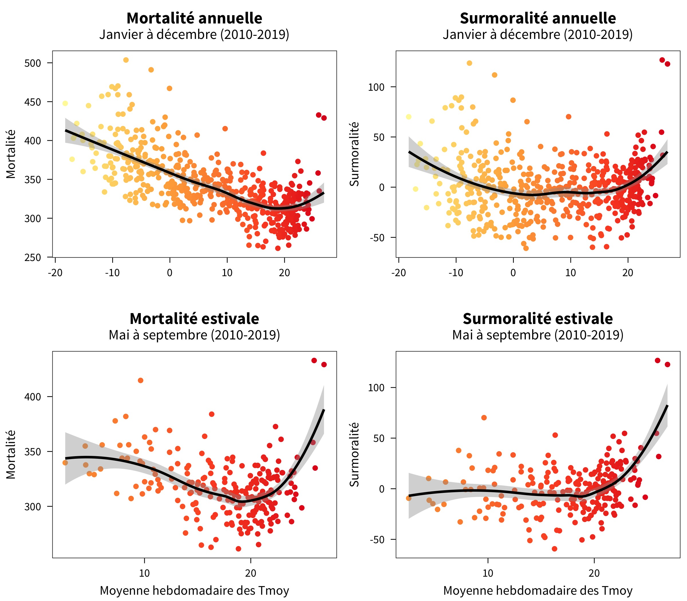
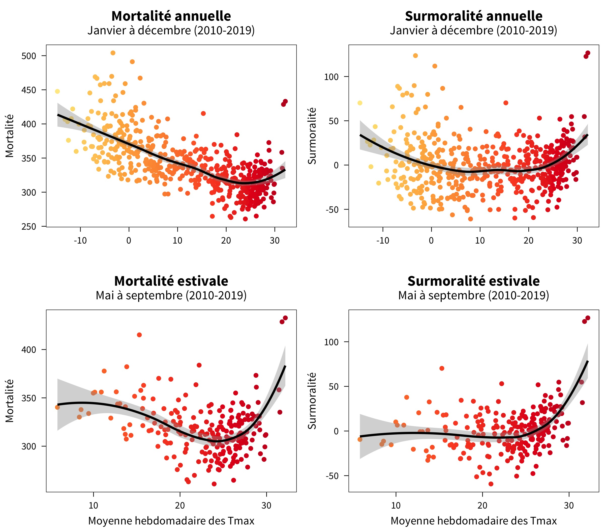

Décès hebdomadaires à Montréal en fonction de la chaleur observée 🌇
================================================================================

+ Un projet réalisé dans le cadre de mon Ph. D. à l'[Institut national de la recherche scientifique](http://inrs.ca) (INRS)
+ Les scripts et les données sont rendus disponibles sous la license [Creative Common License ](http://creativecommons.org/licenses/by-nc-nd/4.0/)
+ Les question peuvent être addressées directement à l'adresse : __[Prénom].[Nom] [at] inrs.ca__

À l'aide de données de décès hebdomadaires de l'Institut de la Statistique du Québec (ISQ), je tente de voir si des pics de décès peuvent être associés à des épisodes de chaleur extrême durant l'été à Montréal, Québec, Canada.

Ce travail est un projet exploratoire qui fait partie de mon Ph. D. en santé environnementale et en science des données à l'INRS. Il chercher à démontrer la possibilité d'utiliser des données ouvertes (décès et météo) pour analyser les relations entre la santé et l'environnement.

Données
--------------------------------------------------------------------------------

J'ai téléchargé les données de décès hebdomadaires de `2010` à `2022` à partir du site web de l'[Institut de la Statistique du Québec](https://statistique.quebec.ca/fr/document/nombre-hebdomadaire-de-deces-au-quebec) (ISQ). 

__Figure 1 : Décès hebdomadaires par âge__

__Figure 2 : Décès hebdomadaires par région__

__Figure 3 : Décès hebdomadaires par sexe__

J'ai ensuite téléchargé les données des stations météorologiques d'Environnement et Changement climatique Canada (ECCC) situées à Montréal à l'aide du package `weathercan` au pas de temps quotidien pour la température moyenne, maximale et minimale. À des fins de simplication, les données de toutes les stations ont été aggrégées spatialement.

__Figure 4 : Températures quotidiennes à Montréal__

Finalement, les données météorologiques ont été ramenées au pas de temps hebdomadaire en prenant la moyenne des températures quotidienne minimales, moyennes et maximales, en plus du minimum et de la moyenne des températures quotidiennes minimales et du maximum et de la moyenne des températures quotidiennes maximales. Ces données ont été fusionnées avec les données de décès hebdomadaire de l'ISQ pour toute la région de Montréal et Laval, mais sans distinction entre les groupes d'âge ou les sexes (données non disponibles).

Résultats
--------------------------------------------------------------------------------

Plutôt que d'étudier les mortalités directement, j'ai convenu qu'il serait mieux de regarder les surmortalités, c'est-à-dire les pics de mortalité au-delà de ceux normalement attendus. J'ai utilisé 4 méthodes pour trouver les surmortalités :

+ Moyenne des mortalités à chaque mois durant l'année
+ Spline continue en fonction du temps du passe (période pré-COVID-19 seulement)
+ Spline unique en fonction de la semaine
+ Fonction polynomiale de degrée 3 en fonction de la semaine

### Figure 5 : Résultat des 4 méthodes pour extraire la surmortalité

Les surmortalités résultantes avec les 4 méthodes étaient très similaires.

### Figure 6 : Surmortalité avec les 4 méthodes

Par la suite, les données de températures ont été conjointement avec les mortalités et surmortalités. Un graphique intéressant était d'extraire les 30 plus grandes surmortalités en fonction de la température.

### Figure 7 : 30 surmortalités les plus importantes à Montréal

Finalement, des relations ont été établis entre la température et la mortalité/surmortalité pour Montréal.

### Figure 9.1 : Relation avec les températures moyennes (2010-2022)

### Figure 9.2 : Relation avec les températures moyennes (2010-2019)

### Figure 9.3 : Relation avec les températures maximales (2010-2019)

Conclusion
--------------------------------------------------------------------------------

La mortalité/surmortalité à Montréal augmente de manière non linéaire à mesure les températures deviennent plus élevées. De plus, les pics de surmortalité permettent d'identifier les pics d'importance en lien avec des épisodes particulièrement chauds, notamment en 2010, en 2018, en 2020 (simultanément à un de COVID-19) et en mai 2022, plus récemment.

Pistes futures
--------------------------------------------------------------------------------

* Ajouter d'autres variables météorologiques (p. ex. humdité, vents)
* Bâtir un modèle prédictif pour la relation décès-chaleur
* Utiliser une meilleure agrégation spatiale des stations météorologiques de Montréal
* Meilleur choix des stations à Montréal avec polygone des RSS
* Raffiner la méthode utilisée pour extraire la surmortalité

___Enjoy !___ ✌🏻
